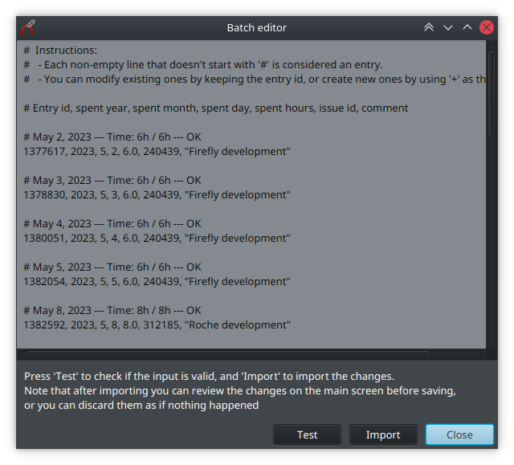

# Redmine editor

Kotlin+JavaFX app for edit redmine time entries and issues in a fast and easy way.

## ~~Installation~~ Download

Download the latest version from the [build](build) folder (linux/windows zip). Extract anywhere.

No need to install anything else! (it requires a JVM, but it is included, that's why the zip is relatively large).

## Run

Launch the Redmine(.bat) shortcut from the main folder.

## Setup (first config)

1) When the app is run for the first time, it will ask to open settings. If not (or if you need to close the screen because it isn't showing correctly) go to 'Edit' -> 'Settings...'.
2) Fill the domain. For Hiberus just press on 'Predefined' and choose it. For other Redmine instance just provide the main page url.
3) Fill the API key. Press instructions and then 'open' (or follow the instructions there), login if required and copy/paste the alphanumeric string. This API key allows the app to access your account without any user/password.
4) [Optional] Press 'Test API' to check if the site is correctly configured.
5) Calendar: Choose your official calendar. If you need a custom one, follow the instructions from the readme in the conf/calendars folder.
6) Configure the rest of the settings as desired. They are less important and explained in its description. In doubt just leave the default value.
7) Press 'Save'. You are now ready to use the app.

## UI usage

Just load the app, choose any day, and press the +/- buttons of any issue shown to increase/decrease the time spent for an issue for that day.\
Dimmed issues are those with 0 spent hours, for quick usage. Even if they are dimmed it doesn't mean they can't be interacted with.\
If your issue isn't shown on the list, press on 'choose existing' or paste the id/url in the textbox below.

When finished editing, press 'save' to upload the changes.

## Automatic imputation

This app can be used to impute automatically in a specific issue. To do so the best alternative is to run the program from command line `./RedmineEditor -h` or `RedmineEditor.bat -h` and follow the instructions there.

## Other features

### Tools -> Evidences

Generates a text placeholder to copy/paste and fill.

### Tools -> Batch Editor

Allows editing the loaded entries as text (useful for replacing issues/comments all at once, for example).

### Tools -> Month Fixer

Auto-spents hours for all missing days in a month/week.

This tool has a **command line** option that you can use by running the executable with the `-h` flag. 

## Uninstall

Just remove the downloaded folder. That's it!

Note: The settings are saved by java automatically on your computer with other java app's settings, if you want to remove them too you will need to search and find them (depends on the java version and OS). Optionally, before deleting the app, go to settings, load the 'default' values and save. You can then delete.

## Contribution

All help is welcomed! Just clone the project and start editing. It is developed on Kotlin and uses JavaFX. Feel free to ask if you need anything!
