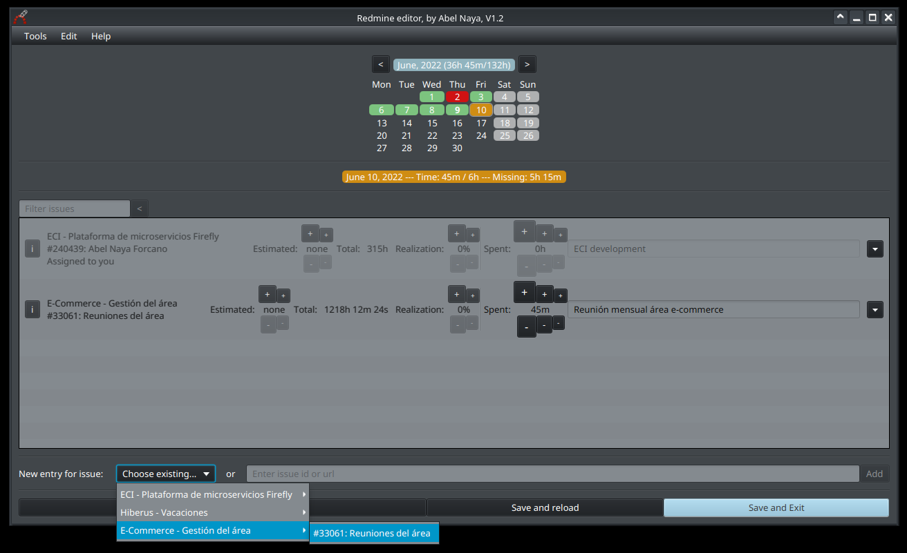
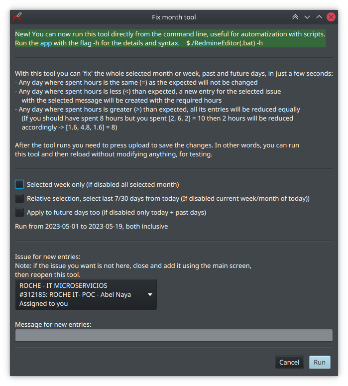
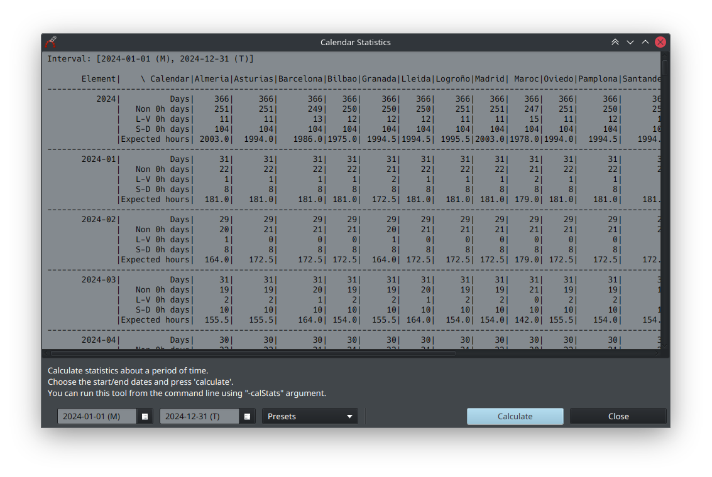
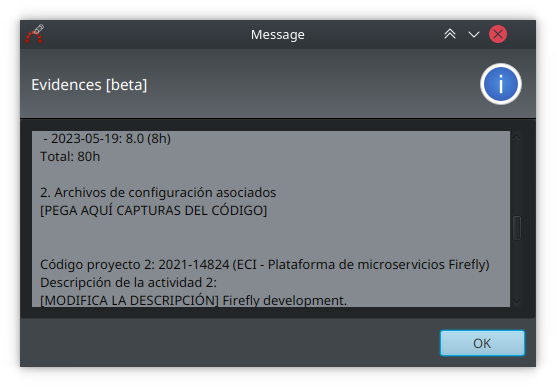

# Redmine editor

Kotlin+JavaFX app for edit redmine time entries and issues in a fast and easy way.



## ~~Installation~~ Download

Download the [latest version](https://github.com/anayaHiberus/redmineeditor/releases/latest) zip (linux or windows). Extract anywhere.

That's it! No need to install anything else! (it requires a JVM, but it is included, that's why the zip is quite large).

## Run

Launch the RedmineEditor(.bat) shortcut inside the main folder.


## Setup (first config)

1) When the app is run for the first time, it will ask to open settings. If not (or if you need to close the screen because it isn't showing correctly) go to 'Edit' -> 'Settings...'.
2) Fill the domain. For Hiberus just press on 'Predefined' and choose it. For other Redmine instance just provide the main page url.
3) Fill the API key. Press instructions and then 'open' (or follow the instructions there), login if required and copy/paste the alphanumeric string. This API key allows the app to access your account without any user/password.
4) [Optional] Press 'Test API' to check if the site is correctly configured.
5) Calendar: Choose your official calendar. If you need a custom one, follow the instructions from the readme in the conf/calendars folder.
6) Configure the rest of the settings as desired. They are less important and explained in its description. In doubt just leave the default value.
7) Press 'Save'. You are now ready to use the app.

## UI usage

Just load the app, choose any day, and press the +/- buttons of any issue shown to increase/decrease the time spent for an issue for that day.\
If your issue isn't shown on the list, press on 'choose existing' or paste the id/url in the textbox below.

When finished editing, press one of the 'save' buttons to upload the changes.

## Uninstall

Just remove the downloaded folder. That's it!

Note: The settings are saved by java automatically on your computer with other java app's settings, if you want to remove them too you will need to search and find them (depends on the java version and OS). Optionally, before deleting the app, go to settings, load the 'default' values and save. You can then delete.

## Automatic imputation

This app can be used to impute automatically in a specific issue. To do so the best alternative is to run the program from command line `./RedmineEditor -h` or `RedmineEditor.bat -h` and follow the instructions there.

If you want to create a remote cron, you can use and adapt one of these samples:

<details>
<summary>Bash</summary>

```bash
EDITOR_URL="https://github.com/anayaHiberus/redmineeditor/releases/latest/download/RedmineEditor-linux.zip"
REDMINE_URL="https://redmine.hiberus.com/redmine/" #Hiberus
REDMINE_KEY="<your api key here>"
ISSUE="<issue to use here>"
COMMENT="<comment to use here>"

echo "Downloading"
wget "$EDITOR_URL" --output-document zip.zip
unzip zip.zip
cd RedmineEditor
chmod u+x RedmineEditor

echo "Configuring"
./RedmineEditor -settings --URL="$REDMINE_URL" --KEY="$REDMINE_KEY" 

echo "Running"
./RedmineEditor -fix -week -relative --issue="$ISSUE" --comment="$COMMENT"
```

</details>


<details>
<summary>Github action</summary>

If you want to automate it with a github action, here is a sample one. Remember to set the corresponding variables and secrets!

```yaml
# run the script
name: Redmine cron
on:

  # manually
  workflow_dispatch:

  # cron
  schedule:
    - cron: 0 8,15 * * mon-fri # will run at 9/10 and 16/17 madrid time

jobs:
  script:
    runs-on: ubuntu-latest
    steps:
      - name: Run script
        env:
          EDITOR_URL: ${{ vars.EDITOR_URL }}
          REDMINE_URL: ${{ vars.REDMINE_URL }}
          REDMINE_KEY: ${{ secrets.REDMINE_KEY }}
          ISSUE: ${{ vars.ISSUE }}
          COMMENT: ${{ vars.COMMENT }}

        run: |
          echo "Downloading"
          wget "$EDITOR_URL" --output-document zip.zip
          unzip zip.zip
          cd RedmineEditor
          chmod u+x RedmineEditor

          echo "Configuring"
          ./RedmineEditor -settings --URL="$REDMINE_URL" --KEY="$REDMINE_KEY"

          echo "Running"
          ./RedmineEditor -fix -week -relative --issue="$ISSUE" --comment="$COMMENT"
```

</details>

<details>
<summary>Custom calendar file</summary>

If you want to use a custom calendar file, replace the

```bash
echo "Configuring"
./RedmineEditor -settings --URL="$REDMINE_URL" --KEY="$REDMINE_KEY" 
```

with

```bash
echo "Configuring"
echo "$CALENDAR" > conf/calendars/custom.hours
./RedmineEditor -settings --URL="$REDMINE_URL" --KEY="$REDMINE_KEY" --SCHEDULE_FILE=custom
```

And add a new variable in the step (remember to fill it inside github!)

```yml
...
env:
  CALENDAR: ${{ secrets.CALENDAR }}
  ...
```

</details>

# Other features

## Command line usage

The app has some command line tools. You can launch the app with `-h` to show the full documentation.

## ICS calendars

You can create an ics calendar file with the holidays of a specific calendar. See the Command line usage section for details.

Alternatively you can subscribe to the automatically generated files from the official Hiberus calendars, available here: https://github.com/anayaHiberus/redmineeditor/releases/tag/ics

## Tools -> Fill range

Auto-spents hours for all missing days in a period.

You can quickly fix a full month by pressing the right arrow on any issue. The month will be fixed with that particular issue+comment.

Alternatively, run it from the command line (see the autoimputation and the command line usage sections).

 $$ TODO: update

## Tools -> Batch Editor

Allows editing the loaded entries as text (useful for replacing issues/comments all at once, for example).

## Tools -> Calendar statistics

Shows a bunch of statistics from the available calendars in a date range.



## Tools -> Evidences

Probably no longer needed.

Generates a text placeholder to copy/paste and fill.



# Contribution

All help is welcomed! Just clone the project and start editing. It is developed on Kotlin and uses JavaFX. Feel free to ask if you need anything!
