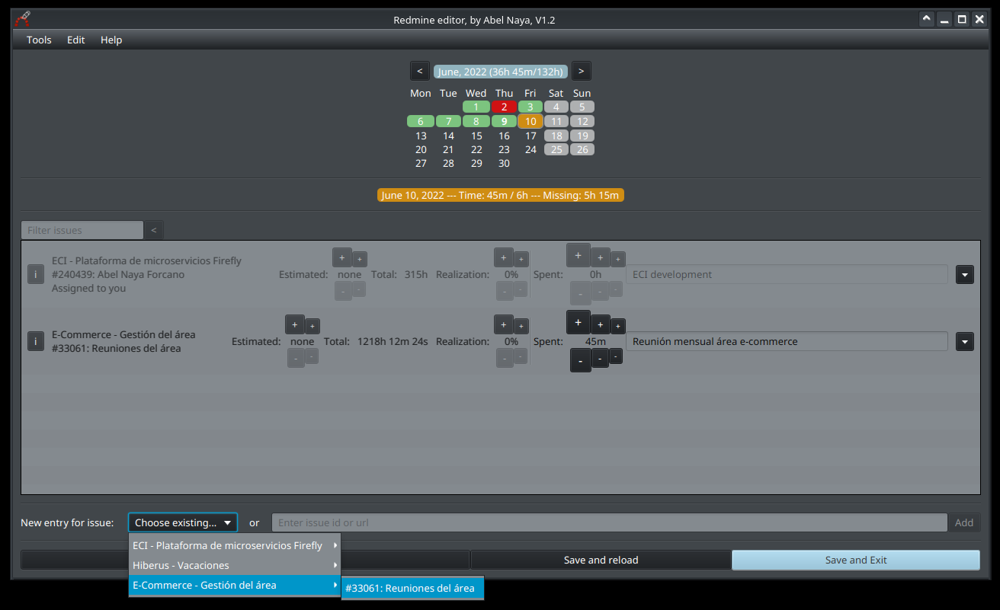

# Redmine editor

Kotlin+JavaFX app for edit redmine time entries and issues in a fast and easy way.

## Download

Download the latest version from the [build](build) folder (linux/windows zip). Extract anywhere.

No need to install anything else! (it requires a JVM, but it is included, that's why the zip is relatively large).

## Run

Launch the Redmine(.bat) shortcut from the main folder.

## Uninstall

Just remove the downloaded folder. That's it!

Note: The settings are saved by java automatically on your computer with other java app's settings, if you want to remove them too you will need to search and find them (depends on the java version and OS). Optionally, before deleting the app, go to settings, load the 'default' values and save. You can then delete.

## Contribution

All help is welcomed! Just clone the project and start editing. It is developed on Kotlin and uses JavaFX. Feel free to ask if you need anything!
